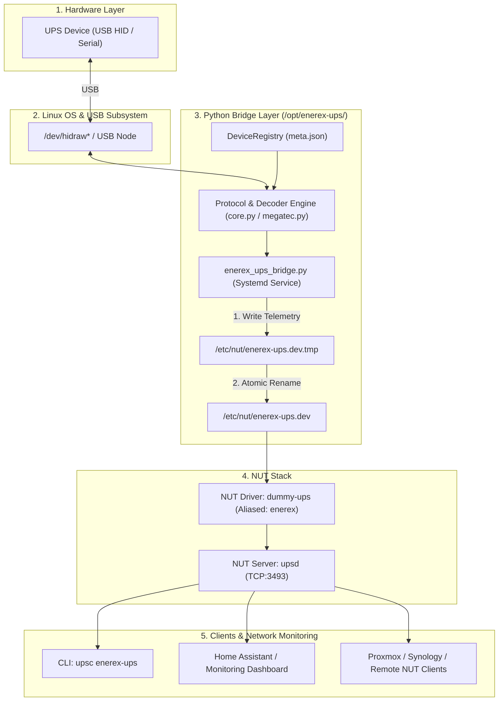

# Universal UPS Bridge for Linux (NUT Integration)

ระบบบริดจ์ (Bridge) และไดรเวอร์สื่อสารฮาร์ดแวร์สำหรับเชื่อมต่ออุปกรณ์สำรองไฟ (UPS) แบรนด์ Enerex, Phoenixtec และ MEC เข้ากับระบบจัดการพลังงาน NUT (Network UPS Tools) บนระบบปฏิบัติการ Linux รองรับการใช้งานบน Orange Pi Zero, Raspberry Pi และเซิร์ฟเวอร์ตระกูล Debian/Ubuntu

---

## สารบัญ
1. [Quick Start (การติดตั้งแบบเร็ว)](#quick-start-การติดตั้งแบบเร็ว)
2. [ภาพรวมและวัตถุประสงค์](#ภาพรวมและวัตถุประสงค์)
3. [อุปกรณ์ที่รองรับ](#อุปกรณ์ที่รองรับ)
4. [สถาปัตยกรรมและหลักการทำงาน](#สถาปัตยกรรมและหลักการทำงาน)
5. [โครงสร้างไฟล์](#โครงสร้างไฟล์)
6. [การทำงานของสคริปต์ install.sh](#การทำงานของสคริปต์-installsh)
7. [การตรวจสอบสถานะและแก้ไขปัญหา](#การตรวจสอบสถานะและแก้ไขปัญหา)
8. [คุณลักษณะทางเทคนิค](#คุณลักษณะทางเทคนิค)

---

## Quick Start (การติดตั้งแบบเร็ว)

```bash
# 1. เพิ่มสิทธิ์การรันสคริปต์
chmod +x install.sh

# 2. รันสคริปต์ติดตั้งระบบ (ต้องใช้สิทธิ์ root)
sudo ./install.sh

# 3. ตรวจสอบข้อมูล Telemetry จาก NUT (รอระบบเริ่มต้นประมาณ 2-5 วินาที)
upsc enerex-ups
```

ตัวอย่างผลลัพธ์:
```text
battery.charge: 100
device.mfr: Enerex
device.model: Innova Unity IOT Tower
input.frequency: 50.0
input.voltage: 228.4
output.current: 0.8
output.frequency: 50.0
output.voltage: 230.0
ups.load: 12
ups.status: OL
ups.temperature: 31.0
```

---

## ภาพรวมและวัตถุประสงค์

เครื่องสำรองไฟตระกูล Enerex, Phoenixtec และ MEC ใช้โปรโตคอลการสื่อสารเฉพาะ (Custom USB HID Feature Reports หรือ Megatec Q1 Protocol) ซึ่งไดรเวอร์มาตรฐานของ NUT (`usbhid-ups` หรือ `blazer_usb`) ไม่สามารถถอดรหัสข้อมูลได้อย่างถูกต้อง เช่น การเรียงลำดับไบต์ (Endianness) ไม่ตรงกัน, ค่าแรงดันไฟฟ้าคลาดเคลื่อน หรือสัญญาณรบกวนในค่าโหลด

ระบบนี้ทำหน้าที่เป็นตัวกลาง (Middleware Bridge) เพื่อ:
1. สื่อสารกับอุปกรณ์ผ่านพอร์ต USB โดยตรงด้วย Low-level Driver
2. ถอดรหัสค่าตัวแปรทางไฟฟ้า (Voltage, Frequency, Load, Battery Capacity, สถานะการทำงาน) ให้ถูกต้องตามโปรไฟล์ของแต่ละรุ่น
3. แปลงข้อมูลให้อยู่ในรูปแบบตัวแปรมาตรฐานของ NUT และส่งต่อให้ไดรเวอร์ `dummy-ups` เพื่อให้เซอร์วิส `upsd` และไคลเอนต์เครือข่ายสามารถนำข้อมูลไปใช้งานได้ตามมาตรฐาน

---

## อุปกรณ์ที่รองรับ

ตรวจจับอัตโนมัติ (Auto-Detection) ตามโปรไฟล์ใน `ups_module/meta.json`:

| รุ่น (Model) | USB VID:PID | โปรโตคอล |
| :--- | :--- | :--- |
| **Innova Unity IOT Tower** | `0x06DA:0xFFFF` | `phoenixtec_hid` |
| **Innova Basic G2** | `0x06DA:0xFFFF` | `phoenixtec_hid` |
| **Offline UPS 2000D** | `0x06DA:0xFFFF` | `phoenixtec_hid` |
| **MEC0003 (800E)** | `0x0001:0x0000` | `megatec_q1` |

---

## สถาปัตยกรรมและหลักการทำงาน



### ลำดับการประมวลผล (Execution Flow)
1. **Auto-Detection**: ตรวจสอบการเชื่อมต่อ USB HID เทียบกับ Vendor ID / Product ID ในระบบ
2. **Data Polling & Decoding**: ดึงค่า Telemetry ทุก 1 วินาที และถอดรหัสโครงสร้างไบต์ตามโปรไฟล์อุปกรณ์
3. **Atomic File Write**: บันทึกข้อมูลลงในไฟล์ชั่วคราวแล้วสลับเป็น `/etc/nut/enerex-ups.dev` ด้วย `os.rename()` เพื่อป้องกันปัญหาการอ่านไฟล์ไม่สมบูรณ์
4. **NUT Distribution**: ไดรเวอร์ `dummy-ups` อ่านไฟล์สถานะและกระจายตัวแปรผ่านโปรโตคอล NUT มาตรฐาน

---

## โครงสร้างไฟล์

```text
linux/
├── enerex_ups_bridge.py      # เซอร์วิสหลักสำหรับ Poll ข้อมูลและแปลงเข้าสู่ dummy-ups
├── install.sh                # สคริปต์ติดตั้งระบบ, คอนฟิก NUT และตั้งค่า Systemd
├── Issues.md                 # เอกสารบันทึกปัญหาและแนวทางทดสอบสอบเทียบค่า Telemetry
├── README.md                 # เอกสารกำกับการใช้งานระบบ (ไฟล์นี้)
└── ups_module/               # ไลบรารี Python สำหรับติดต่อสื่อสารกับฮาร์ดแวร์
    ├── client.py             # UPSClient API อินเทอร์เฟซระดับสูง
    ├── core.py               # Low-level HID Engine และตัวถอดรหัส Byte Offsets
    ├── device_registry.py    # ระบบจับคู่โปรไฟล์อุปกรณ์จาก meta.json
    ├── meta.json             # ฐานข้อมูล VID/PID และคุณสมบัติของ UPS แต่ละรุ่น
    ├── models.py             # Data models และตัวแปลงตัวแปรมาตรฐาน NUT
    ├── events.py             # ระบบ EventBus และ EventDetector
    ├── poller.py             # Thread อ่านข้อมูลเบื้องหลังพร้อมระบบ Reconnect
    ├── store.py              # In-memory thread-safe cache
    ├── drivers/
    │   └── megatec.py        # ไดรเวอร์โปรโตคอล Megatec Q1
    ├── linux_setup.py        # สคริปต์สร้าง udev rules และตรวจสอบระบบ
    └── demo.py               # เครื่องมือทดสอบการอ่านค่าผ่าน CLI
```

---

## การทำงานของสคริปต์ install.sh

สคริปต์ `install.sh` ดำเนินการตั้งค่าระบบอัตโนมัติตามลำดับดังนี้:

### 1. ติดตั้ง System Dependencies
ติดตั้งแพ็กเกจระบบที่จำเป็นผ่าน APT:
- `python3-hid`: ไลบรารีสำหรับเข้าถึง `/dev/hidraw`
- `python3-usb`: ไลบรารีสำหรับควบคุม USB Control Transfers

### 2. ยุติการทำงานของเซอร์วิสเดิม
สั่งหยุด `nut-server.service`, `nut-driver.service` และ `enerex-ups-bridge.service` เพื่อปลดล็อกการเข้าถึงไฟล์และพอร์ต USB ก่อนดำเนินการปรับปรุงระบบ

### 3. ติดตั้งโค้ดโปรแกรมไปยัง `/opt/enerex-ups/`
- ล้างไฟล์เดิมและแคช `__pycache__`
- คัดลอกแพ็กเกจ `ups_module` และสคริปต์ `enerex_ups_bridge.py` ไปยัง `/opt/enerex-ups/` พร้อมกำหนดสิทธิ์การรัน (`chmod +x`)

### 4. ปรับแต่งไฟล์คอนฟิก NUT (`/etc/nut/ups.conf`)
- ลบการตั้งค่าเดิมที่ไม่เข้ากัน (เช่น การตั้งค่าไดรเวอร์ `blazer_usb`)
- กำหนดเซกชันอุปกรณ์ใหม่:
  ```ini
  [enerex-ups]
      driver = enerex
      port = /etc/nut/enerex-ups.dev
      desc = "Universal Enerex Python Bridge"
  ```

### 5. เชื่อมโยงไดรเวอร์ (Driver Masking)
สร้าง Symbolic Link จาก `/lib/nut/dummy-ups` ไปยัง `/lib/nut/enerex` เพื่อให้ NUT เรียกใช้ไบนารี `dummy-ups` ภายใต้ชื่อไดรเวอร์ `enerex`

### 6. สร้างไฟล์สถานะเริ่มต้น
สร้างไฟล์ `/etc/nut/enerex-ups.dev` กำหนดค่าเริ่มต้น `ups.status: WAIT` และกำหนด Permission เป็น `0666`

### 7. ติดตั้ง Systemd Service
สร้างไฟล์ `/etc/systemd/system/enerex-ups-bridge.service` เพื่อควบคุมให้บริดจ์ทำงานเป็น Background Daemon พร้อมคุณสมบัติเริ่มทำงานอัตโนมัติตอนบูตระบบ และรีสตาร์ทตัวเองทุก 5 วินาทีหากเกิดข้อผิดพลาด

### 8. ปรับปรุง `nut-driver.service`
เพิ่ม prefix เครื่องหมาย `-` หน้าคำสั่ง `/sbin/upsdrvctl start` ในไฟล์คอนฟิกเซอร์วิส เพื่อป้องกันไม่ให้ Systemd ถือว่าเซอร์วิส Failed ในกรณีที่ยังไม่ได้เชื่อมต่ออุปกรณ์ UPS

### 9. เริ่มการทำงานของระบบ
โหลดค่าคอนฟิก Systemd ใหม่ (`daemon-reload`), สั่ง Enable และ Start เซอร์วิส `enerex-ups-bridge`, `nut-driver` และ `nut-server`

---

## การตรวจสอบสถานะและแก้ไขปัญหา

### การตรวจสอบสถานะเซอร์วิส
```bash
# ตรวจสอบสถานะการทำงานของ Bridge Service
sudo systemctl status enerex-ups-bridge

# ดู Log การทำงานแบบ Real-time
sudo journalctl -u enerex-ups-bridge -f

# ตรวจสอบสถานะของ NUT Server
sudo systemctl status nut-server
```

### การสแกนข้อมูลดิบเพื่อการสอบเทียบ (Diagnostic Mode)
หากต้องการตรวจสอบข้อมูลดิบระดับฮาร์ดแวร์ (Raw Feature Reports):
```bash
cd /opt/enerex-ups
sudo python3 -m ups_module.core
```

---

## คุณลักษณะทางเทคนิค

1. **Atomic File Replacement**: ใช้การเขียนไฟล์ชั่วคราวแล้วสลับด้วย Inode Operation (`os.rename`) เพื่อป้องกันไม่ให้ NUT Server อ่านข้อมูลที่ยังเขียนไม่เสร็จ
2. **Auto-Recovery & Disconnect Handling**: รองรับการตัดการเชื่อมต่อและเสียบสายใหม่โดยอัตโนมัติ พร้อมอัปเดตสถานะเป็น `OFF` ทันทีเมื่ออุปกรณ์ขาดการเชื่อมต่อ
3. **Sensor Noise Filtering**: กรองข้อมูลสัญญาณรบกวนจากตัวแปลงสัญญาณในฮาร์ดแวร์บางรุ่น (เช่น ค่า Load ค้างที่ 19–21% ในรุ่น Offline 2000D)
4. **Native NUT Coexistence**: ใช้งานร่วมกับโครงสร้าง NUT เดิมได้โดยไม่จำเป็นต้องแก้ไข Source Code ของระบบปฏิบัติการ
