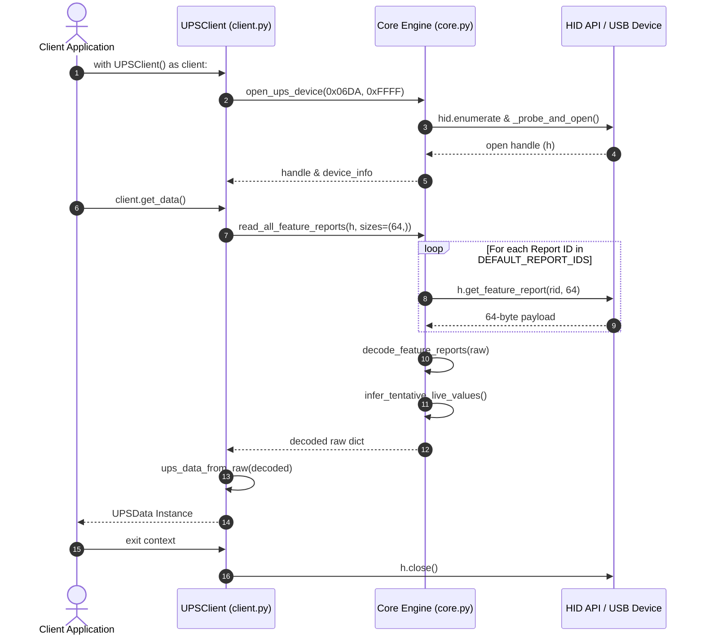
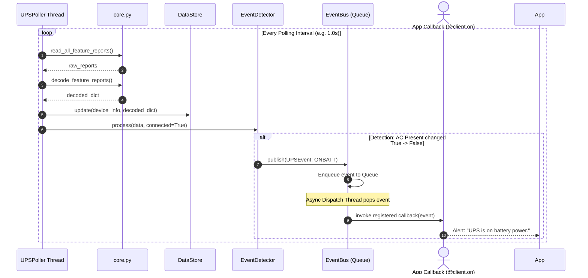

# คู่มือโครงสร้างโมดูลและหลักการทำงานของ ups_module (Linux)

เอกสารนี้อธิบายสถาปัตยกรรม โครงสร้างโมดูล หน้าที่ของแต่ละไฟล์ และหลักการทำงานโดยละเอียดของแพ็กเกจ `ups_module` สำหรับระบบปฏิบัติการ Linux ในการสื่อสารกับอุปกรณ์ UPS ผ่านโปรโตคอล USB HID (เช่น **Phoenixtec Innova Unity** / VID: `0x06DA`, PID: `0xFFFF`)

---

## 1. ภาพรวมสถาปัตยกรรมระบบ (System Architecture)

```mermaid
graph TD
    subgraph User / Application Layer
        App[Application / Web Daemon / CLI Script]
    end

    subgraph High-Level Client Layer
        UPSClient[client.py: UPSClient]
        Poller[poller.py: UPSPoller]
    end

    subgraph Event & Storage Layer
        Store[store.py: DataStore]
        EventBus[events.py: EventBus]
        Detector[events.py: EventDetector]
    end

    subgraph Data Model Layer
        Models[models.py: UPSData / UPSEvent / NotifyType]
        Serializer[serializer.py: sanitize_for_json]
    end

    subgraph Core Engine & Hardware Layer
        Core[core.py: Protocol & HID Engine]
        LinuxSetup[linux_setup.py: udev & System Check]
        Device[(UPS Device: VID 0x06DA / PID 0xFFFF)]
    end

    App -->|Query / Command| UPSClient
    App -->|Background Monitor| Poller
    UPSClient -->|Read/Control| Core
    Poller -->|Read Cycle| Core
    Poller -->|Update State| Store
    Poller -->|Process Transition| Detector
    Detector -->|Publish Event| EventBus
    EventBus -->|Callback| App
    Core -->|HID Feature Reports| Device
    Core -->|Map to Raw Dict| Models
    Models -->|to_nut_dict()| App
```

---

## 2. ตารางสรุปโมดูล (Module Summary Table)

| ชื่อไฟล์ / โมดูล | หน้าที่หลัก |
| :--- | :--- |
| `core.py` | Engine หลักในการค้นหาอุปกรณ์ อ่าน Feature Report, Decode ข้อมูล และแปลงค่าทางไฟฟ้า |
| `client.py` | High-Level Interface (`UPSClient`) ให้แอปพลิเคชันเรียกใช้งานในสไตล์ PyNUT / Context Manager |
| `models.py` | โมเดลข้อมูลมาตรฐาน NUT (`UPSData`, `UPSEvent`, `NotifyType`) พร้อม helper ในการแปลงฟอร์แมต |
| `events.py` | ระบบ Event Bus (Asynchronous Queue) และ `EventDetector` สำหรับตรวจจับการเปลี่ยนสถานะ |
| `poller.py` | Thread ทำงานเบื้องหลัง (Background Polling) สำหรับอ่านค่า UPS ต่อเนื่อง และอัปเดตข้อมูล |
| `store.py` | In-Memory Data Store แบบ Thread-Safe สำหรับเก็บสถานะล่าสุดของ UPS |
| `serializer.py` | Utility สำหรับแปลงชนิดข้อมูล Python (Datetime, Bytes) ให้รองรับ JSON |
| `linux_setup.py` | สคริปต์ตรวจเช็คความพร้อมของระบบ Linux และติดตั้ง udev rules (`/etc/udev/rules.d/`) |
| `install.sh` | Shell Script สำหรับติดตั้ง dependencies ทั้งหมดและรัน `linux_setup.py` ในขั้นตอนเดียว |
| `demo.py` | สคริปต์ CLI สำหรับทดสอบระบบ (One-shot, Polling, Monitor, System Check) |

---

## 3. รายละเอียดของแต่ละโมดูลอย่างเจาะลึก (Detailed Module Breakdown)

### 3.1 `core.py` — Core HID Protocol Engine
เป็นหัวใจสำคัญระดับล่างสุด (Low-Level Driver) ที่ติดต่อกับอุปกรณ์ผ่านไลบรารี `hidapi`

*   **`open_ups_device(vid, pid)`**:
    *   ค้นหา USB HID Device ที่ตรงกับ VID/PID
    *   รองรับการเลือกพอร์ตอัจฉริยะใน Linux (`_probe_and_open`) เนื่องจากใน Linux `hidraw` จะรายงาน `usage_page` เป็น `0x0000` เสมอ ฟังก์ชันจะทดสอบอ่าน Report `0x01` หรือ `0x06` เพื่อหา interface ที่ตอบสนองจริง โดยไม่สั่งปิด-เปิดซ้ำ (`open->close->reopen`) ซึ่งป้องกันปัญหา Device Reset
*   **`read_feature_report_best(h, rid, sizes)`**:
    *   ส่งคำสั่งอ่าน HID Feature Report ตาม Report ID (`rid`)
    *   ใช้ขนาดการอ่าน `64-byte` เพียงครั้งเดียวต่อ Report ID (ลดจำนวน USB Transaction ลงเหลือเพียง 21 ครั้ง ช่วยให้การอ่านเร็วขึ้น ~4 เท่า)
*   **`decode_feature_reports(raw)`**:
    *   นำ Raw Byte Arrays จาก Feature Reports แต่ละ ID มาถอดรหัสเป็นข้อมูลที่เข้าใจได้ เช่น:
        *   **Report 0x01**: สถานะหลัก (AC Line Present, Discharging, Charging, Bypass, Status Good)
        *   **Report 0x02**: ข้อผิดพลาด (Internal Failure, Battery Replacement, Overload, Shutdown Imminent)
        *   **Report 0x06**: ความจุแบตเตอรี่ (%) และ Runtime คงเหลือ (วินาที)
        *   **Report 0x07**: WorkMode (Line/OnBattery/Bypass/Standby), Percent Load, Temperature
        *   **Report 0x31**: Input Frequency & Input Voltage (แรงดันไฟฟ้าขาเข้า)
        *   **Report 0x42**: Output Power Meter (W, VA, Current, Frequency, Voltage)
*   **`infer_tentative_live_values(raw, decoded)`**:
    *   อัลกอริทึมสำรองสำหรับการประเมินค่าแรงดันและ ความถี่ขาเข้า/ขาออก จาก 16-bit payload เผื่อกรณีที่ Firmware ไม่ส่งตามฟิลด์ปกติ

---

### 3.2 `client.py` — PyNUT-Compatible High-Level API
มอบคุณสมบัติการเข้าถึงข้อมูลแบบพกพาง่าย สนับสนุน Context Manager (`with UPSClient() as client:`)

*   **`UPSClient` Class**:
    *   `connect()` / `disconnect()`: จัดการการเชื่อมต่อกับอุปกรณ์ HID
    *   `get_data()`: คืนค่าเป็นวัตถุ `UPSData` (Strongly Typed Object)
    *   `get_vars()`: คืนค่าเป็น `dict` รูปแบบ NUT Key-Value (เช่น `"ups.status": "OL"`, `"battery.charge": 100`)
    *   `get_var(varname)`: อ่านค่าตัวแปรรายตัวตามชื่อ NUT (เช่น `"input.voltage"`)
    *   `get_status()`: คืนค่าสตริงสถานะ NUT เช่น `"OL"` (On Line), `"OB"` (On Battery), `"OB LB"` (Low Battery)
*   **การส่งคำสั่งควบคุม (Control Commands)**:
    *   `run_self_test()` / `abort_self_test()`: สั่งทดสอบแบตเตอรี่ (Report `0x24`)
    *   `schedule_shutdown(delay_seconds)` / `cancel_shutdown()`: ตั้งเวลาปิดการจ่ายไฟ (Report `0x09`)
    *   `sync_time()`: ซิงค์นาฬิกาภายใน UPS (Report `0x29`)
    *   `set_voltage(voltage)` / `set_frequency(freq)`: ตั้งค่า Nominal Output (Report `0x72`, `0x0D`)
*   **Background Monitor Support**:
    *   `start_monitor(interval)` / `stop_monitor()`: เปิด Background Thread เพื่อคอยตรวจจับ Event
    *   `@client.on(NotifyType.ONBATT)`: Decorator สำหรับลงทะเบียน Callback เมื่อเกิดเหตุการณ์

---

### 3.3 `models.py` — Standardized Data Models
กำหนดโครงสร้างข้อมูลให้สอดคล้องกับมาตรฐาน **NUT (Network UPS Tools)**

*   **`NotifyType`**: รหัสประเภท Event มาตรฐาน เช่น `ONLINE`, `ONBATT`, `LOWBATT`, `FSD` (Forced Shutdown), `REPLBATT`, `COMMOK`, `COMMBAD`, `CHARGING`, `OVERLOAD`, `OVER_TEMP`
*   **`UPSEvent`**: Dataclass บันทึกข้อมูลเหตุการณ์ประกอบด้วย `notify_type`, `message`, `timestamp` และ `data`
*   **`UPSData`**: Dataclass หลักที่รวมฟิลด์ข้อมูลทั้งหมดของ UPS:
    *   **Status**: `ups_status`, `ups_mode`
    *   **Battery**: `battery_charge`, `battery_runtime`, `battery_voltage`, `battery_temperature`
    *   **Input**: `input_voltage`, `input_frequency`, `input_voltage_nominal`
    *   **Output**: `output_voltage`, `output_frequency`, `output_current`, `output_power`, `output_power_apparent`
    *   **UPS Config**: `ups_load`, `ups_temperature`, `ups_firmware`
*   **Helper Methods**:
    *   `to_nut_dict()`: แปลงข้อมูลเป็น Dict รูปแบบ Dot-notation (ข้ามฟิลด์ที่เป็น `None`)
    *   `to_json()`: แปลงข้อมูลเป็น JSON String
    *   `is_on_battery()`, `is_low_battery()`, `is_online()`, `is_charging()`: ฟังก์ชันเช็คสถานะทางตรรกะ

---

### 3.4 `events.py` — Asynchronous Event Bus & Detector
ระบบประมวลผลเหตุการณ์แบบไม่Synchronous เพื่อรองรับการแจ้งเตือนเมื่อเกิดความผิดปกติเกี่ยวกับไฟฟ้า

*   **`EventBus`**:
    *   ใช้ `queue.Queue` และ Background Worker Thread ในการส่งผ่าน Event ไปยัง Callback Handlers
    *   ป้องกันไม่ให้การทำงานหลักกระตุกเมื่อ Callback Handler ใช้เวลาประมวลผลนาน
    *   รองรับทั้ง Specific Listener (`subscribe(handler, notify_type)`) และ Global Listener
*   **`EventDetector`**:
    *   เปรียบเทียบ `UPSData` สแนปช็อตปัจจุบันกับสแนปช็อตรอบก่อนหน้า (`prev`)
    *   เมื่อพบการเปลี่ยนแปลงเงื่อนไข เช่น `AC Present: True -> False` จะสร้าง `UPSEvent(NotifyType.ONBATT)` และ Publish เข้าสู่ `EventBus` ทันที

---

### 3.5 `poller.py` — Thread-Safe Background Poller Engine
ทำหน้าที่อ่านข้อมูลจาก UPS อย่างต่อเนื่องตามรอบเวลาที่กำหนด (`polling interval`)

*   **`UPSPoller` Class**:
    *   จัดการวงรอบการอ่านค่าแบบอัตโนมัติ พร้อมระบบ Reconnect อัตโนมัติเมื่อสาย USB ถูกถอดออกหรือสัญญาณขาดหาย
    *   นำข้อมูล Raw จาก `core.py` อัปเดตไปยัง `DataStore` และส่งต่อให้ `EventDetector` ตรวจสอบ Event
    *   รองรับการดึงข้อมูล Descriptor Metadata และ Sysfs Data บน Linux

---

### 3.6 `store.py` — Thread-Safe In-Memory Snapshot Store
*   **`DataStore` Class**:
    *   ใช้ `threading.Lock()` ป้องกันปัญหา Race Condition เมื่อมีการอ่านและเขียนข้อมูลพร้อมกันจากหลาย Thread
    *   เก็บสแนปช็อตรวมทั้ง `device_info`, `ups_dict` (NUT format), `raw_dict`, `timestamp` และ `status_message`
    *   ให้บริการ API สำหรับ Web Server / REST API ในการอ่านสแนปช็อตล่าสุด (`get_snapshot()`, `get_ups_data()`)

---

### 3.7 `serializer.py` — Data Sanitizer & JSON Encoder
*   **`sanitize_for_json(data)`**:
    *   แปลงวัตถุที่ไม่สามารถ Serialize เป็น JSON ได้โดยตรง (เช่น `datetime`, `bytes`, `Enum`, `dataclass`) ให้กลายเป็นชนิดข้อมูลพื้นฐาน (`str`, `int`, `float`, `dict`, `list`)
    *   ช่วยให้สามารถนำผลลัพธ์ไปใช้งานกับ Flask, FastAPI หรือส่งออกไฟล์ JSON ได้สะดวก

---

### 3.8 `linux_setup.py` & `install.sh` — Deployment & Permission Utilities
อำนวยความสะดวกในการติดตั้งและกำหนดสิทธิ์ในระบบปฏิบัติการ Linux

*   **`linux_setup.py`**:
    *   `check_system_deps()`: ตรวจสอบ Library ที่จำเป็นในระบบ (`libhidapi-hidraw0`, `libusb-1.0-0`) และ Python Package (`hidapi`)
    *   `install_udev_rule()`: สร้างไฟล์ `/etc/udev/rules.d/99-ups-hid.rules` เพื่อกำหนดสิทธิ์ `MODE="0666"` และกลุ่ม `plugdev` ให้กับ USB Device (VID: `0x06DA`, PID: `0xFFFF`) เพื่อให้ผู้ใช้ทั่วไป (Non-root user) เข้าถึงอุปกรณ์ได้โดยไม่ต้องใช้ `sudo`
    *   `check_device_permission()`: ทดสอบเปิดอุปกรณ์จริงว่าสามารถอ่านข้อมูลได้หรือไม่
*   **`install.sh`**:
    *   Shell Script สำหรับรันคำสั่งติดตั้ง `apt-get install`, `pip install` และเรียก `linux_setup.py` อัตโนมัติ

---

### 3.9 `demo.py` — CLI & Usage Demonstration Tool
สคริปต์บรรทัดคำสั่งสำหรับทดสอบและตรวจสอบการทำงาน

*   **โหมดการใช้งาน (`--mode`)**:
    *   `--check`: ตรวจสอบความพร้อมของระบบ (System Check)
    *   `oneshot` (Default): อ่านค่าจาก UPS ครั้งเดียวแล้วแสดงผลเหมือนคำสั่ง `upsc` ของ NUT
    *   `var`: อ่านค่าตัวแปรรายตัว (เช่น `python3 demo.py --mode var --var battery.charge`)
    *   `poll`: อ่านค่าและแสดงผลแบบต่อเนื่องตามช่วงเวลา (`--interval 2.0`)
    *   `monitor`: เฝ้าติดตาม Event ของ UPS (แสดงข้อความเตือนเมื่อไฟดับ / ไฟมา)

---

## 4. แผนผังลำดับการทำงาน (Sequence Diagrams)

### 4.1 การอ่านค่าแบบ One-shot Read (`client.get_data()`)



### 4.2 การเฝ้าระวังและส่ง Event แบบ Async (`UPSPoller` & `EventBus`)

