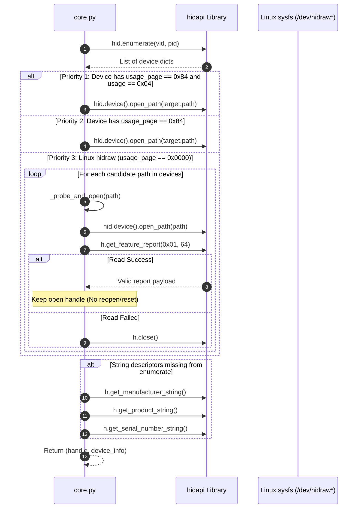
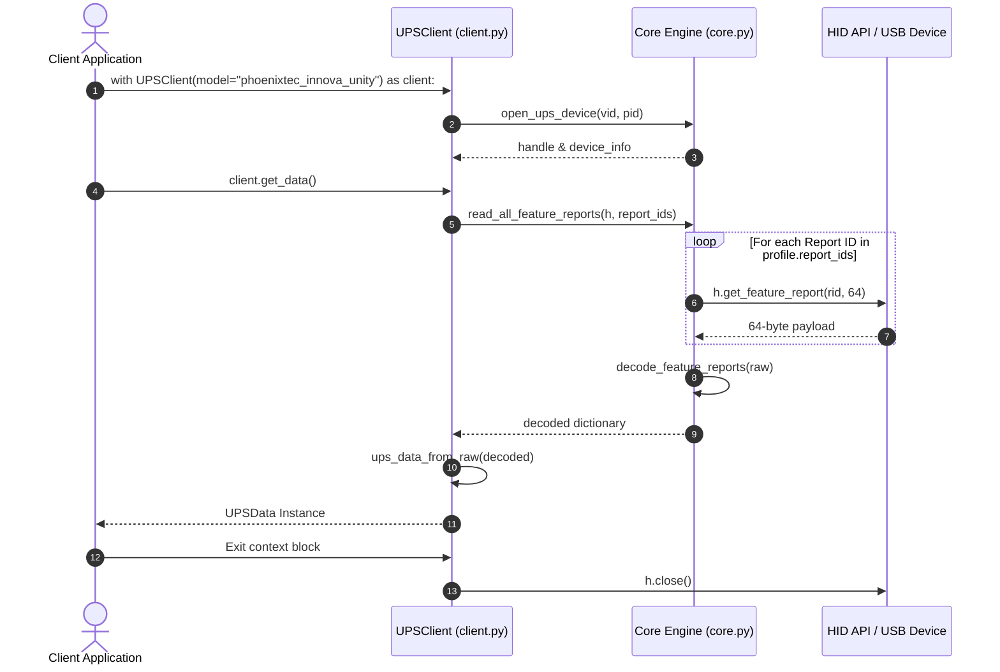
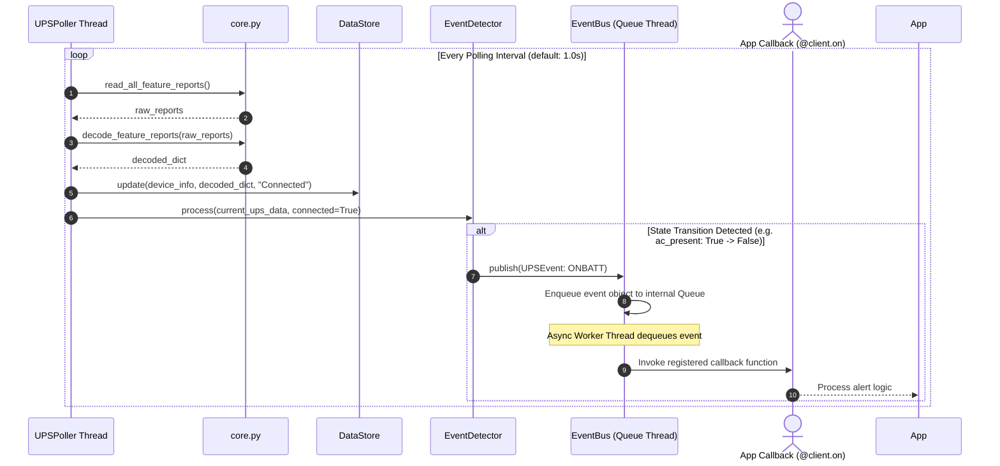

# คู่มือสถาปัตยกรรมและรายละเอียดการทำงานของ ups_module (Linux)

เอกสารนี้อธิบายสถาปัตยกรรม โครงสร้างโมดูล หน้าที่ของไฟล์ทั้งหมด และหลักการทำงานระดับล่าง (Low-Level Drivers/Protocols) ของแพ็กเกจ `ups_module` สำหรับระบบปฏิบัติการ Linux ในการสื่อสารกับอุปกรณ์ UPS ผ่านโปรโตคอล USB HID

---

## 1. ภาพรวมสถาปัตยกรรมระบบ (System Architecture)

```mermaid
graph TD
    subgraph User / Application Layer
        App[Application / Web Daemon / CLI Script]
    end

    subgraph High-Level Client Layer
        UPSClient[client.py: UPSClient]
        Poller[poller.py: UPSPoller]
    end

    subgraph Registry & Configuration Layer
        Registry[device_registry.py: DeviceRegistry]
        MetaJSON[meta.json: Device Profiles Registry]
    end

    subgraph Event & Storage Layer
        Store[store.py: DataStore]
        EventBus[events.py: EventBus]
        Detector[events.py: EventDetector]
    end

    subgraph Data Model Layer
        Models[models.py: UPSData / UPSEvent / NotifyType]
        Serializer[serializer.py: sanitize_for_json]
    end

    subgraph Core Engine & Hardware Layer
        Core[core.py: Protocol & HID Engine]
        LinuxSetup[linux_setup.py: udev & System Check]
        Device[(UPS HID Devices)]
    end

    App -->|Query / Command| UPSClient
    App -->|Background Monitor| Poller
    Registry -->|Load Profiles| MetaJSON
    UPSClient -->|Get Device Info| Registry
    UPSClient -->|Read/Control| Core
    Poller -->|Read Cycle| Core
    Poller -->|Update State| Store
    Poller -->|Process Transition| Detector
    Detector -->|Publish Event| EventBus
    EventBus -->|Callback| App
    Core -->|HID Feature Reports| Device
    Core -->|Map to Raw Dict| Models
    Models -->|to_nut_dict()| App
```

---

## 2. ตารางสรุปโมดูลและไฟล์ทั้งหมดในแพ็กเกจ (Module Summary Table)

| ชื่อไฟล์ | หน้าที่หลักและขอบเขตการทำงาน |
| :--- | :--- |
| `device_registry.py` | โหลดและค้นหาข้อมูลอุปกรณ์จาก `meta.json` (ค้นหาด้วย ID, VID/PID, หรือ Auto-detection) |
| `meta.json` | ไฟล์ข้อมูลการลงทะเบียนอุปกรณ์ USB HID (Vendor ID, Product ID, Report IDs) |
| `core.py` | Engine หลักในอ่าน HID Feature Reports, ถอดรหัส Byte Offsets และส่งคำสั่งควบคุมฮาร์ดแวร์ |
| `client.py` | Interface หลัก (`UPSClient`) สำหรับแอปพลิเคชัน รองรับ Context Manager และ PyNUT-style API |
| `models.py` | Dataclass มาตรฐาน NUT (`UPSData`, `UPSEvent`, `NotifyType`) และฟังก์ชันแปลงฟอร์แมตข้อมูล |
| `events.py` | ระบบ Asynchronous Queue Event Bus (`EventBus`) และตัวตรวจจับการเปลี่ยนสถานะ (`EventDetector`) |
| `poller.py` | Thread ทำงานเบื้องหลัง (`UPSPoller`) สำหรับอ่านค่า UPS ต่อเนื่องพร้อมระบบ Reconnect อัตโนมัติ |
| `store.py` | In-Memory Data Store แบบ Thread-Safe ที่ใช้ `threading.Lock()` ป้องกัน Race Condition |
| `serializer.py` | Utility ฟังก์ชัน (`sanitize_for_json`) แปลงวัตถุ Python ให้รองรับโครงสร้าง JSON |
| `linux_setup.py` | สคริปต์ตรวจเช็คความพร้อมของระบบ Linux และติดตั้ง udev rules (`/etc/udev/rules.d/99-ups-hid.rules`) |
| `install.sh` | Shell Script สำหรับติดตั้ง dependencies ทั้งหมดและเรียก `linux_setup.py` ในขั้นตอนเดียว |
| `uninstall.sh` | Shell Script สำหรับถอนการติดตั้ง Python packages และลบ udev rules |
| `demo.py` | สคริปต์ CLI สำหรับทดสอบระบบ (One-shot, Polling, Monitor, System Check) |

---

## 3. รายละเอียดเจาะลึกของแต่ละโมดูล (Detailed Module Specifications)

### 3.1 `device_registry.py` & `meta.json` — Multi-Model Registry Engine

โมดูลจัดการโปรไฟล์อุปกรณ์ UPS โดยโหลดโครงสร้างจาก `meta.json`

#### คลาส `DeviceProfile` (Dataclass)
* `id` (`str`): รหัสระบุโมเดลอุปกรณ์ (ค่าตัวอย่าง `"phoenixtec_innova_unity"`)
* `manufacturer` (`str`): ชื่อผู้ผลิตสำรอง (ค่าตัวอย่าง `"PHOENIXTEC"`)
* `model` (`str`): ชื่อรุ่นอุปกรณ์สำรอง (ค่าตัวอย่าง `"Innova Unity IOT Tower"`)
* `vid` (`int`): รหัส USB Vendor ID (ค่าตัวอย่าง `0x06DA`)
* `pid` (`int`): รหัส USB Product ID (ค่าตัวอย่าง `0xFFFF`)
* `protocol` (`str`): ชื่อโปรโตคอลการถอดรหัส (ค่าตัวอย่าง `"phoenixtec_hid"`)
* `report_ids` (`list[int]`): รายการ Report IDs ที่อุปกรณ์รองรับ
* `notes` (`str`): ข้อความบันทึกข้อมูลเพิ่มเติม

#### คลาส `DeviceRegistry`
* `devices` (`property -> list[DeviceProfile]`): คืนค่ารายการโปรไฟล์อุปกรณ์ทั้งหมดที่ลงทะเบียนไว้
* `get_by_id(device_id: str) -> DeviceProfile | None`: ค้นหาโปรไฟล์ตามรหัส `id`
* `get_by_vid_pid(vid: int, pid: int) -> DeviceProfile | None`: ค้นหาโปรไฟล์ตามคู่ `vid` และ `pid`
* `get_all_vid_pid_pairs() -> list[tuple[int, int]]`: คืนค่าคู่ `(vid, pid)` ทั้งหมดที่ลงทะเบียน
* `detect_connected() -> DeviceProfile | None`: ตรวจสอบการเชื่อมต่อฮาร์ดแวร์จริงผ่าน `hid.enumerate` กับทุก `(vid, pid)` ในระบบ คืนค่าโปรไฟล์แรกที่พบการเชื่อมต่อ
* `get_default() -> DeviceProfile`: คืนค่าโปรไฟล์แรกสุดใน `meta.json` เพื่อใช้เป็นค่าเริ่มต้น

---

### 3.2 `core.py` — Low-Level HID Protocol Engine

ทำหน้าที่ติดต่อกับอุปกรณ์ฮาร์ดแวร์ผ่านไลบรารี `hidapi`

#### 1. การเปิดและการค้นหาอุปกรณ์ (`open_ups_device`)
* **ลำดับการเลือกพอร์ต (Priority Resolution)**:
  1. ค้นหาอุปกรณ์ที่มี `usage_page == 0x84` และ `usage == 0x04` (UPS Power Device)
  2. ค้นหาอุปกรณ์ที่มี `usage_page == 0x84`
  3. กรณีระบบ Linux `hidraw` ซึ่งคืนค่า `usage_page` เป็น `0x0000`: ใช้ฟังก์ชัน `_probe_and_open` ในการทดสอบอ่าน Feature Report บนพอร์ต `/dev/hidraw*` โดยไม่มีการเปิดและปิดพอร์ตซ้ำ (`open->close->reopen`) เพื่อป้องกันการReset อุปกรณ์
* **การอ่าน String Descriptors**: กรณีที่ `enumerate()` คืนค่าสตริงว่าง ฟังก์ชันจะอ่าน Manufacturer, Product, และ Serial Number จาก Handle ที่เปิดอยู่โดยตรง หากอ่านไม่ได้จะใช้ค่าสำรองจาก `DeviceProfile`

#### 2. การอ่านและถอดรหัส HID Feature Reports
* `read_feature_report_best(h, rid, sizes)`: อ่าน Feature Report ขนาด 64-byte ตาม Report ID `rid`
* `read_all_feature_reports(h, report_ids, sizes, retries, include_zero)`: วนลูปอ่าน Feature Reports ตามรายการ `report_ids` คืนค่าดิบเป็น `dict[int, list[int]]`
* `decode_feature_reports(raw: dict[int, list[int]]) -> dict`: ถอดรหัสโครงสร้างไบต์เป็นคีย์ข้อมูล:
  * **Report 0x01** (6 Bytes):
    * `Byte 0`: `ac_present` (`bool`) — สถานะไฟเข้า AC
    * `Byte 1`: `below_capacity_limit` (`bool`) — เตือนความจุแบตเตอรี่ต่ำกว่าขีดจำกัด
    * `Byte 2`: `charging` (`bool`) — สถานะการชาร์จแบตเตอรี่
    * `Byte 3`: `bypass` (`bool`) — สถานะการทำงานโหมด Bypass
    * `Byte 4`: `discharging` (`bool`) — สถานะการคายประจุแบตเตอรี่ (จ่ายไฟจากแบตเตอรี่)
    * `Byte 5`: `status_good` (`bool`) — สถานะทั่วไปปกติ
  * **Report 0x02** (4 Bytes):
    * `Byte 0`: `internal_failure` (`bool`) — ข้อผิดพลาดภายในวงจร
    * `Byte 1`: `need_replacement` (`bool`) — เตือนต้องเปลี่ยนแบตเตอรี่
    * `Byte 2`: `overload` (`bool`) — เตือนภาระโหลดเกินพิกัด
    * `Byte 3`: `shutdown_imminent` (`bool`) — เตือนกำลังจะปิดการจ่ายไฟทันที
  * **Report 0x03** (1 Byte):
    * `Byte 0`: `over_temperature` (`bool`) — เตือนอุณหภูมิสูงเกินพิกัด
  * **Report 0x05** (1 Byte):
    * `Byte 0`: `switchable` (`bool`) — สถานะเปิด/ปิดเอาต์พุตได้
  * **Report 0x06** (5 Bytes):
    * `Byte 0`: `battery.charge` / `battery_capacity_percent` (`int`) — ความจุแบตเตอรี่ (%)
    * `Byte 1–4`: `runtime_remaining_sec` / `battery.runtime` (`int` 32-bit Little-Endian) — เวลาสำรองไฟคงเหลือ (วินาที)
  * **Report 0x07** (11 Bytes):
    * `Byte 0`: `work_mode_code` (`int`: 1=Standby, 2=Bypass, 3=Line, 4=OnBattery, 5=Test)
    * `Byte 1`: `percent_load` (`int`) — ภาระโหลด (%)
    * `Byte 3–4`: `temperature_c` / `ups.temperature` (`float` 16-bit Little-Endian, Kelvin) — แปลงเป็นองศาเซลเซียสด้วยสูตร `(K - 273.15)`
    * `Byte 9–10`: `battery_voltage_v` (`float` 16-bit Little-Endian) — หารด้วย `10.0` (โวลต์)
  * **Report 0x08** (1 Byte):
    * `Byte 0`: `low_batt_alert_limit_percent` (`int`) — ขีดจำกัดแจ้งเตือนแบตเตอรี่ต่ำ (%)
  * **Report 0x0C** (4 Bytes):
    * `Byte 2`: `battery.charge.low` (`int`) — ขีดจำกัดแบตเตอรี่ต่ำ (%)
    * `Byte 3`: `battery.charge.high` (`int`) — ขีดจำกัดแบตเตอรี่เต็ม (%)
  * **Report 0x0D** (1 Byte):
    * `Byte 0`: `input.frequency` (`int`) — ความถี่ไฟเข้า (Hz)
  * **Report 0x10**:
    * รายการไบต์ที่ไม่เป็นศูนย์: `supported_reports` (`list[str]`) — รายการ Report IDs ที่ฮาร์ดแวร์รองรับ
  * **Report 0x14** (2 Bytes):
    * `Byte 0`: `input.frequency.nominal` (`int`) — ความถี่ไฟเข้าพิกัด (Hz)
    * `Byte 1`: `input.voltage.nominal` (`int`) — แรงดันไฟเข้าพิกัด (V)
  * **Report 0x17** (2 Bytes):
    * `Byte 0–1`: `input.transfer.low` (`int` 16-bit Little-Endian) — จุดตัดแรงดันไฟเข้าต่ำสุด (V)
  * **Report 0x24** (1 Byte):
    * `Byte 0`: `battery_test_status_raw` (`int`), `battery_test_status` (`str`: 0x01="idle", 0x02="warning", 0x03="abort", 0x04="failed", 0x05="running")
  * **Report 0x25** (3 Bytes):
    * `Byte 1–2`: `runtime_alt_sec` (`int` 16-bit Little-Endian) — เวลาสำรองไฟสำรอง (วินาที)
  * **Report 0x26** (3 Bytes):
    * `Byte 0–2`: `ups.firmware` (`str` รูปแบบ `"{Byte0}.{Byte1}.{Byte2}"`)
  * **Report 0x27** (4 Bytes):
    * `Byte 3`: `test_discharge_active` (`bool`) — สถานะคายประจุระหว่างทดสอบ
  * **Report 0x29** (4 Bytes):
    * `Byte 0–3`: `last_event_date` (`str` 32-bit Little-Endian Unix Timestamp แปลงเป็น UTC string)
  * **Report 0x31** (4 Bytes):
    * `Byte 0–1`: `input.frequency` (`float` 16-bit Little-Endian) / 10.0 (Hz)
    * `Byte 2–3`: `input.voltage` (`float` 16-bit Little-Endian) / 10.0 (V)
  * **Report 0x42** (14 Bytes):
    * `Byte 4–5`: `output_active_power_w` (`int` 16-bit Little-Endian) (W)
    * `Byte 6–7`: `output_apparent_power_va` (`int` 16-bit Little-Endian) (VA)
    * `Byte 8–9`: `output_current_a` (`float` 16-bit Little-Endian) / 10.0 (A)
    * `Byte 10–11`: `output_frequency_hz` (`float` 16-bit Little-Endian) / 10.0 (Hz)
    * `Byte 12–13`: `output_voltage_v` / `output.voltage` (`float` 16-bit Little-Endian) / 10.0 (V)
  * **Report 0x4A** (1 Byte):
    * `Byte 0`: `converter_mode` (`int`)
  * **Report 0x74** (5 Bytes):
    * `Byte 1–2`: `config_max_active_power_w` (`int` 16-bit Little-Endian) (W)
    * `Byte 3–4`: `config_max_apparent_power_va` (`int` 16-bit Little-Endian) (VA)
  * **การคำนวณสถานะรวม (`ups.status`)**:
    * รวมสถานะธงสร้างเป็นสตริง NUT: `OL` (On Line), `OB` (On Battery), `OFF` (Off/Voltage < 50V), `BYPASS` (Bypass Active), `DISCHRG` (Discharging), `LB` (Low Battery), `OVER` (Overload)

#### 3. ฟังก์ชันการส่งคำสั่งควบคุมฮาร์ดแวร์ (Control Functions)
* `run_self_test(h) -> bool`: เขียนไปยัง Report `0x24` ด้วย Payload `[0x24, 0x05]`
* `abort_self_test(h) -> bool`: เขียนไปยัง Report `0x24` ด้วย Payload `[0x24, 0x03]`
* `schedule_shutdown(h, delay_sec: int) -> bool`: เขียนไปยัง Report `0x09` ด้วย Payload `[0x09, d0, d1, d2, d3]` (32-bit Little-Endian)
* `cancel_shutdown(h) -> bool`: เขียนไปยัง Report `0x09` ด้วย Payload `[0x09, 0xFF, 0xFF, 0xFF, 0xFF]`
* `sync_time(h, timestamp: int) -> bool`: เขียนไปยัง Report `0x29` ด้วย Payload `[0x29, t0, t1, t2, t3]` (32-bit Little-Endian Unix Timestamp)
* `set_nominal_voltage(h, voltage: int) -> bool`: เขียนไปยัง Report `0x72` ด้วย Payload `[0x72, 0x01, v_low, v_high]` (16-bit Little-Endian)
* `set_nominal_frequency(h, freq: int) -> bool`: เขียนไปยัง Report `0x0D` ด้วย Payload `[0x0D, freq]`

---

### 3.3 `client.py` — High-Level Application API

เป็นเลเยอร์ระดับสูงสำหรับแอปพลิเคชัน ใช้งานผ่านคลาส `UPSClient`

#### คลาส `UPSClient`
* **Initialization**: `UPSClient(model=None, vid=None, pid=None, name="ups@local", report_ids=None)`
  * หากระบุ `model`: โหลด VID, PID และ `report_ids` จาก `DeviceRegistry`
  * หากไม่ระบุ `model` แต่ระบุ `vid`/`pid`: ใช้งาน VID/PID ที่กำหนด
  * หากไม่ระบุใดๆ: ใช้งานค่าเริ่มต้นจากโปรไฟล์แรกใน `meta.json`
* **Method การจัดการการเชื่อมต่อ**:
  * `connect() -> UPSClient`: เปิดพอร์ตเชื่อมต่ออุปกรณ์
  * `disconnect() -> None`: ปิดพอร์ตเชื่อมต่ออุปกรณ์
  * Context Manager (`__enter__` / `__exit__`): เปิดพอร์ตเมื่อเข้าบล็อก `with` และปิดพอร์ตเมื่อออกจากบล็อกโดยอัตโนมัติ
* **Method การดึงข้อมูล**:
  * `get_data() -> UPSData`: คืนค่าวัตถุ `UPSData` สแนปช็อตปัจจุบัน
  * `get_vars() -> dict[str, Any]`: คืนค่า `dict` ในรูปแบบ NUT Key-Value (Dot-notation)
  * `get_var(varname: str) -> Any`: คืนค่าของฟิลด์ NUT ที่กำหนด
  * `get_status() -> str`: คืนค่าสตริง `ups.status` (`"OL"`, `"OB"`, `"OB LB"`)
  * `get_device_info() -> dict`: คืนค่าข้อมูลอุปกรณ์ (`manufacturer`, `model`, `serial`, `vendor_id`, `product_id`, `device_id`)
* **Method การส่งคำสั่งฮาร์ดแวร์**:
  * `run_self_test()`, `abort_self_test()`, `schedule_shutdown(delay_seconds)`, `cancel_shutdown()`, `sync_time(dt=None)`, `set_nominal_voltage(voltage)`, `set_nominal_frequency(freq)`
* **Method การเฝ้าระวังเหตุการณ์**:
  * `start_monitor(interval=1.0)`: เริ่ม Background Polling Thread และ Event Monitoring
  * `stop_monitor()`: หยุด Background Monitoring Thread
  * `@client.on(notify_type)`: Decorator สำหรับลงทะเบียน Callback Handler ตามประเภทเหตุการณ์ `NotifyType`

---

### 3.4 `models.py` — Data Models & Serialization

#### คลาส `NotifyType`
คลาสเก็บค่าคงที่ประเภทเหตุการณ์แจ้งเตือน:
* `ONLINE` = `"ONLINE"` (ระบบไฟฟ้าหลักกลับมาจ่ายไฟ)
* `ONBATT` = `"ONBATT"` (ระบบไฟฟ้าหลักดับ สลับไปใช้ไฟจากแบตเตอรี่)
* `LOWBATT` = `"LOWBATT"` (ความจุแบตเตอรี่ต่ำกว่าขีดจำกัด)
* `FSD` = `"FSD"` (Forced Shutdown)
* `COMMOK` = `"COMMOK"` (การเชื่อมต่อกับอุปกรณ์สำเร็จ)
* `COMMBAD` = `"COMMBAD"` (สูญเสียการเชื่อมต่อกับอุปกรณ์)
* `SHUTDOWN` = `"SHUTDOWN"` (ระบบกำลังปิดการจ่ายไฟ)
* `REPLBATT` = `"REPLBATT"` (เตือนต้องเปลี่ยนแบตเตอรี่)
* `NOCOMM` = `"NOCOMM"` (ไม่สามารถติดต่ออุปกรณ์ได้)
* `CHARGING` = `"CHARGING"` (กำลังชาร์จแบตเตอรี่)
* `OVERLOAD` = `"OVERLOAD"` (ภาระโหลดเกินพิกัด)
* `OVER_TEMP` = `"OVER_TEMP"` (อุณหภูมิสูงเกินพิกัด)

#### Dataclass `UPSEvent`
* `notify_type` (`str`): ประเภทเหตุการณ์จาก `NotifyType`
* `message` (`str`): ข้อความอธิบายเหตุการณ์
* `timestamp` (`str`): เวลาที่เกิดเหตุการณ์ รูปแบบ ISO-8601 (`YYYY-MM-DDTHH:MM:SS`)
* `data` (`dict`): ข้อมูลสแนปช็อตประกอบ ณ เวลาที่เกิดเหตุการณ์

#### Dataclass `UPSData`
โครงสร้างข้อมูลสแนปช็อตมาตรฐานของ UPS พร้อมฟังก์ชันตรวจสอบและแปลงฟอร์แมต:
* **Helper Methods**:
  * `to_nut_dict() -> dict[str, Any]`: แปลงข้อมูลเป็น Dict รูปแบบ Dot-notation ตามมาตรฐาน NUT
  * `to_json() -> str`: แปลงข้อมูลเป็น JSON String
  * `is_online() -> bool`: คืนค่า `True` เมื่อไฟ AC เข้าปกติ
  * `is_on_battery() -> bool`: คืนค่า `True` เมื่อจ่ายไฟจากแบตเตอรี่
  * `is_low_battery() -> bool`: คืนค่า `True` เมื่อแบตเตอรี่ต่ำ
  * `is_charging() -> bool`: คืนค่า `True` เมื่อกำลังชาร์จแบตเตอรี่
  * `is_overloaded() -> bool`: คืนค่า `True` เมื่อเกิด Overload
  * `is_bypass() -> bool`: คืนค่า `True` เมื่ออยู่ในโหมด Bypass

---

### 3.5 `events.py` — Asynchronous Event Bus & Detector

#### คลาส `EventBus`
* ระบบส่งผ่านเหตุการณ์แบบ Asynchronous โดยใช้ `queue.Queue` และ Worker Thread ในการประมวลผล Callback Handlers
* **`subscribe(handler, notify_type=None)`**: ลงทะเบียน Callback Function (หากไม่ระบุ `notify_type` จะรับทุกเหตุการณ์)
* **`unsubscribe(handler, notify_type=None)`**: ยกเลิกการลงทะเบียน Callback Function
* **`publish(event: UPSEvent)`**: ใส่เหตุการณ์เข้าสู่ Queue เพื่อรอประมวลผล
* **`start()` / `stop()`**: ควบคุมการทำงานของ Worker Thread

#### คลาส `EventDetector`
* ทำหน้าที่เปรียบเทียบสแนปช็อต `UPSData` ปัจจุบันกับสแนปช็อตรอบก่อนหน้า (`prev_data`)
* **เงื่อนไขการสร้าง Event**:
  * `ac_present: True -> False` => สร้าง `UPSEvent(NotifyType.ONBATT)`
  * `ac_present: False -> True` => สร้าง `UPSEvent(NotifyType.ONLINE)`
  * `below_capacity_limit: False -> True` หรือ `battery_charge <= low_threshold` => สร้าง `UPSEvent(NotifyType.LOWBATT)`
  * `charging: False -> True` => สร้าง `UPSEvent(NotifyType.CHARGING)`
  * `overload: False -> True` => สร้าง `UPSEvent(NotifyType.OVERLOAD)`
  * `over_temperature: False -> True` => สร้าง `UPSEvent(NotifyType.OVER_TEMP)`
  * `need_replacement: False -> True` => สร้าง `UPSEvent(NotifyType.REPLBATT)`
  * สัญญาณการเชื่อมต่อ `connected: False -> True` => `NotifyType.COMMOK`
  * สัญญาณการเชื่อมต่อ `connected: True -> False` => `NotifyType.COMMBAD`

---

### 3.6 `poller.py` — Background Polling Thread

#### คลาส `UPSPoller` (สืบทอดจาก `threading.Thread`)
* **Initialization**: `UPSPoller(store, detector=None, model=None, vid=None, pid=None, poll_interval=1.0)`
* **วงรอบการทำงาน (Loop Execution)**:
  1. พยายามเปิดอุปกรณ์ผ่าน `core.open_ups_device`
  2. อ่าน Feature Reports ผ่าน `core.read_all_feature_reports` และถอดรหัสผ่าน `core.decode_feature_reports`
  3. อัปเดตข้อมูลสแนปช็อตลงใน `DataStore`
  4. ส่งสแนปช็อตเข้าสู่ `EventDetector.process()` เพื่อตรวจสอบความเปลี่ยนแปลง
  5. หากการเชื่อมต่อขาดหาย: ปิด Handle, บันทึกสถานะ Error ลงใน `DataStore`, สลับเข้าสู่โหมดทดลองเชื่อมต่อใหม่ (Auto-Reconnect) ในรอบถัดไป
* **`stop()`**: ส่งสัญญาณหยุดการทำงานของ Thread

---

### 3.7 `store.py` — Thread-Safe In-Memory Snapshot Store

#### คลาส `DataStore`
* ใช้วัตถุ `threading.Lock()` ในการควบคุมการเข้าถึงข้อมูลตัวแปรภายในแบบ Mutual Exclusion
* **`update(device_info, ups_raw, status_message)`**: บันทึกสแนปช็อตอุปกรณ์ ข้อมูลถอดรหัส ข้อมูล Raw Timestamp ปัจจุบัน (รูปแบบ ISO-8601) และข้อความสถานะ
* **`set_error(message)`**: บันทึกข้อความ Error และล้างค่า Timestamp (ระบุสถานะไม่เชื่อมต่อ)
* **`get_snapshot() -> dict`**: คืนค่า Dict สแนปช็อตรวมประกอบด้วย `device`, `ups`, `timestamp`, `status_message`, `connected`
* **`get_ups_data() -> UPSData`**: แปลงข้อมูลถอดรหัสล่าสุดเป็นวัตถุ `UPSData`
* **`get_device() -> dict`**, **`get_ups_dict() -> dict`**: คืนค่าข้อมูลอุปกรณ์และข้อมูล NUT ตามลำดับ

---

### 3.8 `serializer.py` — JSON Data Sanitizer

#### ฟังก์ชัน `sanitize_for_json(data: Any) -> Any`
แปลงวัตถุชนิดพิเศษของ Python ให้เป็น Data Types มาตรฐานที่แปลงเป็น JSON ได้:
* `datetime.datetime` / `datetime.date` => สตริงรูปแบบ ISO-8601
* `bytes` / `bytearray` => Hex String (รูปแบบ `"0x01 0x06"`)
* `Enum` => ค่า `enum.value`
* Dataclass => `dict` ผ่าน `asdict()`
* `dict` / `list` / `tuple` / `set` => วนลูปแปลงสมาชิกภายในทุกตัว

---

### 3.9 `linux_setup.py`, `install.sh` & `uninstall.sh` — Deployment Suite

#### 1. `linux_setup.py`
* `check_system_deps() -> list[dict]`: ตรวจสอบ Shared Libraries (`libhidapi-hidraw.so`, `libusb-1.0.so`) และ Python Packages (`hidapi`, `pyusb`)
* `generate_udev_rules_all() -> str`: สร้างข้อความ udev rule สำหรับทุกอุปกรณ์ใน `meta.json` ในรูปแบบภาษาอังกฤษ:
  ```properties
  # UPS HID devices — auto-generated from meta.json
  # Generated by: python -m ups_module.linux_setup
  #
  # Allow non-root users to access USB HID devices without sudo
  # hidraw: for hidapi (read Feature Reports)
  # usb:    for pyusb fallback (read Input Voltage via control transfers)

  # PHOENIXTEC Innova Unity IOT Tower (VID=06da PID=ffff)
  SUBSYSTEM=="hidraw", ATTRS{idVendor}=="06da", ATTRS{idProduct}=="ffff", MODE="0666"
  SUBSYSTEM=="usb", ATTRS{idVendor}=="06da", ATTRS{idProduct}=="ffff", MODE="0666"
  ```
* `install_udev_rule(vid, pid, rule_path, all_devices=True) -> tuple[bool, str]`: เขียนไฟล์ `/etc/udev/rules.d/99-ups-hid.rules` และรัน `udevadm control --reload-rules` และ `udevadm trigger` (ต้องใช้ sudo)
* `check_device_permission(vid, pid) -> tuple[bool, str]`: ทดสอบเปิดอุปกรณ์จริงผ่าน `hid.device()` เพื่อยืนยันสิทธิ์การเข้าถึงแบบ non-root
* **CLI Arguments**: `--check` (เช็คสถานะอย่างเดียว), `--vid` (ระบุ VID สั่งงานเฉพาะอุปกรณ์), `--pid` (ระบุ PID สั่งงานเฉพาะอุปกรณ์)

#### 2. `install.sh`
Bash script ทำงานตามลำดับขั้นตอน:
1. เช็คระบบปฏิบัติการว่าเป็น Linux
2. รัน `apt-get install` ติดตั้ง System Dependencies (`pkg-config`, `build-essential`, `python3-dev`, `libudev-dev`, `libhidapi-hidraw0`, `libhidapi-dev`, `libusb-1.0-0-dev`)
3. รัน `pip install -r requirements.txt` ติดตั้ง Python Dependencies
4. รัน `python3 linux_setup.py` ตั้งค่า udev rule และ Reload udevadm

#### 3. `uninstall.sh`
Bash script ถอนการติดตั้ง:
1. อ่านรายการพารามิเตอร์ `-y` หรือ `--yes` เพื่อข้ามการถามยืนยัน
2. ถอนการติดตั้ง Python Packages ที่ระบุใน `requirements.txt` ผ่าน `pip uninstall`
3. ลบไฟล์ udev rule `/etc/udev/rules.d/99-ups-hid.rules` และสั่ง `udevadm control --reload-rules && udevadm trigger`

---

### 3.10 `demo.py` — CLI Operations Suite

สคริปต์บรรทัดคำสั่งสำหรับทดสอบและสั่งงานระบบ

* **Command Line Arguments**:
  * `--check`: ตรวจสอบความพร้อมของระบบ (System Check)
  * `--mode`: เลือกโหมดการทำงาน (`oneshot`, `var`, `poll`, `monitor`)
  * `--model`: เลือกโมเดลอุปกรณ์จาก `meta.json`
  * `--vid` / `--pid`: ระบุ VID/PID แบบ manual
  * `--var`: ระบุชื่อฟิลด์ NUT ที่ต้องการอ่าน (ใช้ร่วมกับ `--mode var`)
  * `--interval`: กำหนดช่วงเวลาอ่านข้อมูล (วินาที) (ใช้ร่วมกับ `--mode poll`)
  * `--json` / `--output-json`: แสดงผลลัพธ์ในรูปแบบ JSON String

---

## 4. แผนผังลำดับการทำงาน (Sequence Diagrams)

### 4.1 ลำดับการทำงานเปิดและค้นหาพอร์ตอุปกรณ์ (`open_ups_device`)



### 4.2 ลำดับการอ่านข้อมูลแบบ One-shot Read (`client.get_data()`)



### 4.3 ลำดับการทำงานอ่านข้อมูลต่อเนื่องและส่งแจ้งเตือน (`UPSPoller` & `EventBus`)

