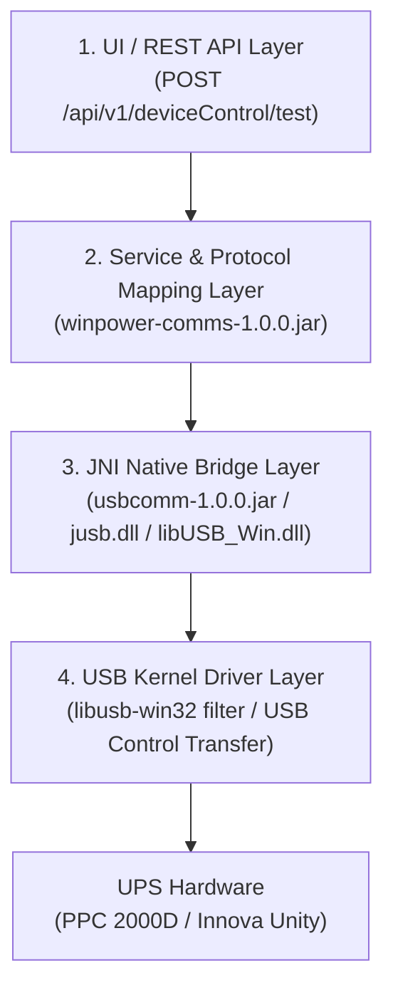

# 📐 เอกสารวิเคราะห์การทำงาน Battery Test ของ WinPower G2 (Reverse Engineering Specification)

เอกสารฉบับนี้รวบรวมข้อมูลสเปก รูปแบบคำสั่ง และสถาปัตยกรรมการสื่อสารการสั่งทดสอบแบตเตอรี่ (Battery Test) ของโปรแกรม **WinPower G2** ที่ถอดรหัสจาก Java Bytecode, JNI Native DLL, และ USB Driver

---

## 1. สถาปัตยกรรมการสื่อสารของ WinPower G2 (Communication Layers)

WinPower G2 แบ่งเลเยอร์การประมวลผลคำสั่ง Battery Test ออกเป็น 4 ชั้นหลัก:



1. **REST API Layer (`winpower-service-1.0.0.jar`)**:
   - รับ HTTP POST Request ที่ `/api/v1/deviceControl/test`
   - Payload: `{"deviceId": "...", "testAction": "QuickTest"}`

2. **Protocol Mapping Layer (`winpower-comms-1.0.0.jar`)**:
   - คลาส `QSetCommandUtils.java` & `FieldToCommand.java`: ตรวจสอบ `protocolId` ของอุปกรณ์
   - คลาส `WorkMode.java`: กำหนด Enum สภาวะโหมด `BatteryTestMode = 5`

3. **Native JNI Bridge (`usbcomm-1.0.0.jar` & `jusb.dll` / `libUSB_Win.dll`)**:
   - คลาส `santak.lib.DeviceUsb` และ `monitor1.WindowsUSB`
   - ส่งคำสั่งผ่าน C Native JNI Function `setReport()` / `OrderUPS()`

4. **USB Driver Filter (`libusb-win32` / `install-filter-amd64.exe`)**:
   - WinPower G2 ติดตั้ง Device Filter Driver บน `USB\Vid_06da&Pid_ffff`
   - บายพาสไดรเวอร์ `hidusb.sys` ของ Windows เพื่อส่ง Direct Control Transfer

---

## 2. รูปแบบคำสั่ง Battery Test แบ่งตามประเภทอุปกรณ์ (Device Protocols)

### 🅰️ ประเภทที่ 1: Line-Interactive / Offline (PPC 2000D - Protocol ID 4 / Megatec Q1)

สำหรับ PPC 2000D (VID `0x06DA`, PID `0xFFFF`) WinPower G2 จะใช้โปรโตคอล **Megatec Q1 String Protocol**:

| รายการทดสอบ | REST API Action | Q1 Command String | CommandID Code | Length |
| :--- | :--- | :--- | :--- | :--- |
| **Quick Battery Test (10s)** | `"QuickTest"` | **`"T\r"`** | `CommandID.T` | 8 Bytes |
| **Deep Battery Test** | `"TestTillLow"` | **`"TL\r"`** | `CommandID.TL` | 8 Bytes |
| **Cancel Battery Test** | `"CancelTest"` | **`"CT\r"`** | `CommandID.CT` | 8 Bytes |

#### โครงสร้างพารามิเตอร์ USB Control Transfer (Level 0):
- **`bmRequestType`**: `0x21` (`Host-to-Device` | `Class Request` | `Interface Recipient`)
- **`bRequest`**: `0x09` (`HID_REQ_SET_REPORT`)
- **`wValue`**: `0x0301` (`Feature Report Type = 0x03`, `Report ID = 0x01`) หรือ `0x0324`
- **`wIndex`**: `0x0000` (Interface 0)
- **`Payload (8 Bytes)`**: 
  - Quick Test: `54 0D 00 00 00 00 00 00` (`b"T\r\x00\x00\x00\x00\x00\x00"`)
  - Deep Test: `54 4C 0D 00 00 00 00 00` (`b"TL\r\x00\x00\x00\x00\x00"`)
  - Cancel Test: `43 54 0D 00 00 00 00 00` (`b"CT\r\x00\x00\x00\x00\x00"`)

---

### 🅱️ ประเภทที่ 2: True Online (Innova Unity / Basic G2 - Protocol ID 15 / Phoenixtec HID)

สำหรับ Innova Unity / Basic G2 WinPower G2 จะใช้โปรโตคอล **Phoenixtec HID Feature Report**:

| รายการทดสอบ | Feature Report ID | Action Code Payload | Length |
| :--- | :--- | :--- | :--- |
| **Quick Battery Test (10s)** | `0x24` หรือ `0x03` | `[ReportID, 0x01]` + Padded 0 | 64 Bytes |
| **Deep Battery Test** | `0x24` หรือ `0x03` | `[ReportID, 0x02]` + Padded 0 | 64 Bytes |
| **Cancel Battery Test** | `0x24` หรือ `0x03` | `[ReportID, 0x03]` + Padded 0 | 64 Bytes |

---

## 3. การอ่านและถอดรหัสสถานะเรียลไทม์ (Status Polling & Telemetry)

WinPower G2 จะทำการส่งคำสั่ง Polling `"Q1\r"` ทุกๆ 1-2 วินาที และนำ Response มาถอดรหัสผ่าน `QuCommandParser.java`:

### 3.1 การถอดรหัส Enum `WorkMode` (คำนวณค่า `mode`)
ในคลาส `com.etn.wp.common.core.constant.ups.WorkMode`:
```java
public enum WorkMode {
    PowerOnMode(0),
    StandbyMode(1),
    BypassMode(2),
    LineMode(3),        // โหมดปกติ (ไฟ AC เข้า)
    BatteryMode(4),     // โหมดไฟดับ (จ่ายจากแบต)
    BatteryTestMode(5), // โหมด Self-Test ในขณะนั้น
    FaultMode(6);
}
```

### 3.2 การสร้างการเตือนภัย `activeAlarms` (Alarm ID 501)
เมื่อสถานะใน Q1 Response ระบุว่ากำลังทดสอบแบตเตอรี่ WinPower G2 จะสร้าง Object การเตือนภัย:
- **Alarm ID**: `501`
- **Alarm Name**: `BatteryTestInProgress`
- **Message**: `"Battery test"`

---

## 4. เงื่อนไขและข้อจำกัดทางเทคนิคของ Windows (Key Technical Gotchas)

1. **ไดรเวอร์ Windows HID (`hidusb.sys`) บล็อกการเขียนข้อมูล**:
   - PPC 2000D มีค่า `OutputReportByteLength = 0` ใน HID Descriptor ทำให้คำสั่ง `WriteFile()` บน Windows ล้มเหลวด้วย `WinError 1`
   - การส่งคำสั่ง `HidD_SetFeature` บน Feature Report บางตัวจะติด `WinError 31` (`ERROR_GEN_FAILURE`) เนื่องจากไดรเวอร์ Windows ไม่อนุญาตให้เขียนข้อมูลที่ไม่ตรงกับ HID Usages Standard

2. **สิทธิ์ในการเปิดพอร์ต (`hid_force_openEx error=13`)**:
   - การสั่งงานตรงผ่าน `libusb0.dll` หรือ `jusb.dll` ต้องรันภายใต้สิทธิ์ **Administrator (Elevated Privilege)** เท่านั้น
   - หากรันในสิทธิ์ User ปกติ ฟังก์ชัน `hid_force_openEx` จะคืนค่า `error=13` (`Permission Denied`)
